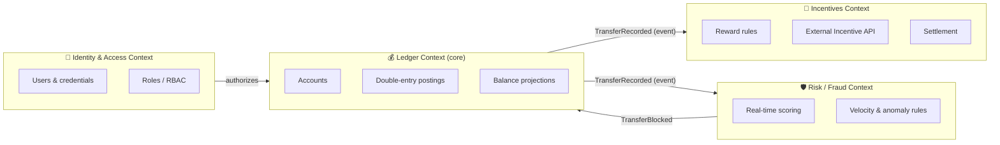
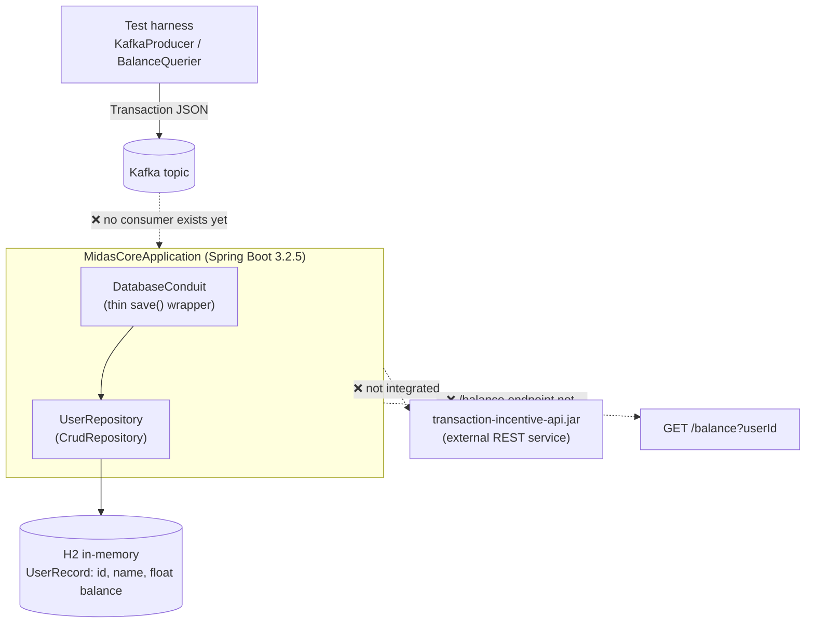
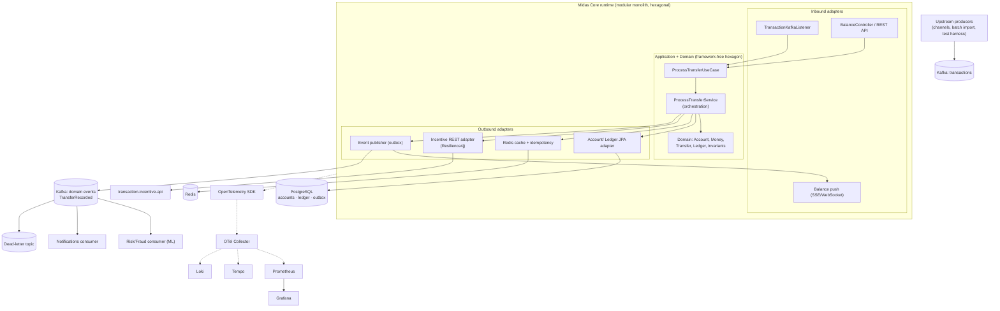
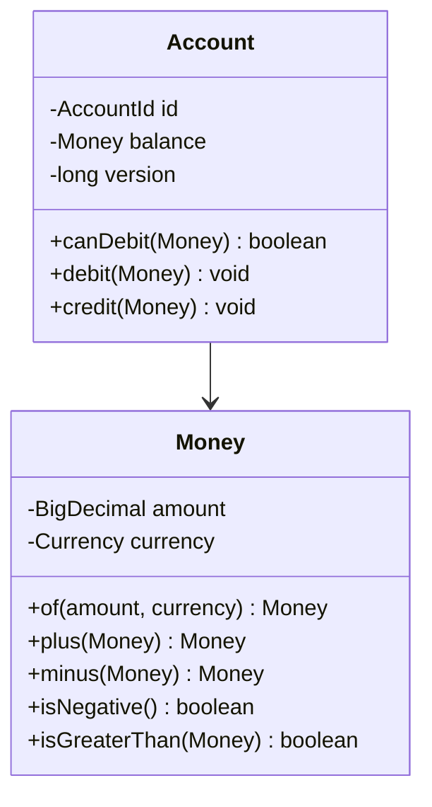
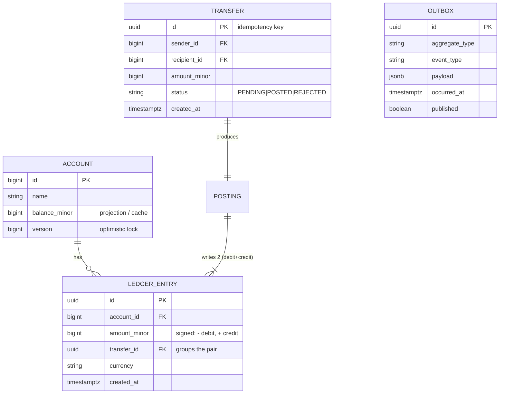
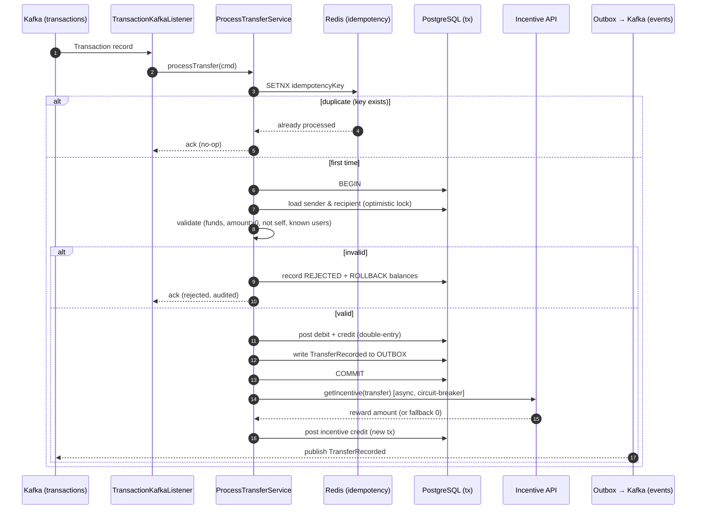
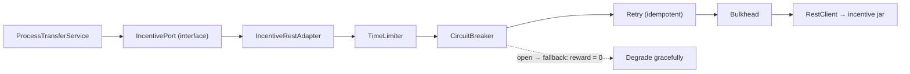
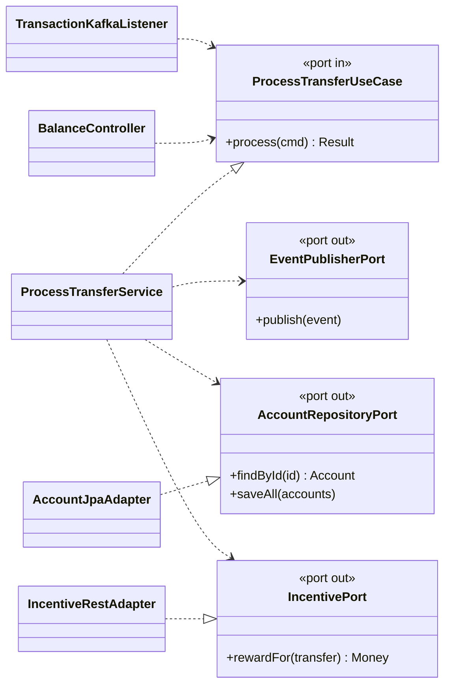
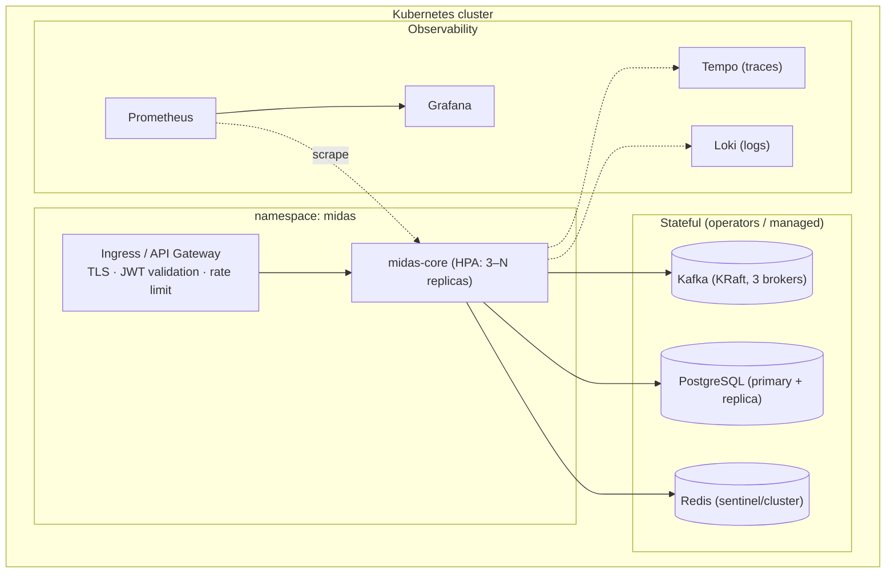

# Midas Core — Target Architecture

> Companion to [`ROADMAP.md`](./ROADMAP.md). This document defines the **to-be** architecture and the design reasoning behind it. The roadmap defines the **sequence of work** to get there.
>
> **Status:** Proposed · **Author:** Principal Engineering · **Audience:** Engineers, reviewers, hiring panels.

---

## 1. Domain analysis

Midas Core is a **real-time peer-to-peer (P2P) value-transfer engine with an incentive/rewards subsystem**. Money flows between accounts as discrete *transactions* that arrive asynchronously over Kafka; each settled transfer may trigger a *reward* computed by an external incentive service; current balances are served synchronously over HTTP.

Stripped to its essence, the system has one non-negotiable invariant:

> **Conservation of value** — money is never created or destroyed by a transfer; every credit has an equal and opposite debit. Balances are a *derived* quantity, not a source of truth.

The baseline violates this invariant structurally (it mutates a `float balance` column in place and never persists the transaction itself), which is the single most important thing this architecture corrects.

### Ubiquitous language

| Term | Meaning |
|---|---|
| **Account** | A named holder of value with a balance. The consistency boundary (aggregate root). |
| **Transfer** | An intent to move `amount` from a sender Account to a recipient Account. |
| **Ledger Entry** | An immutable, append-only fact: a single debit or credit posted to one account. |
| **Posting** | The act of writing the balanced (debit + credit) pair of ledger entries for a transfer. |
| **Incentive / Reward** | A bonus credit computed by the external Incentive API for a settled transfer. |
| **Balance** | A *projection*: the running sum of an account's ledger entries. |
| **Idempotency Key** | A unique transfer identifier used to guarantee a transfer is posted at most once. |

### Bounded contexts

The domain decomposes into four contexts. In the near term they live as **modules inside one deployable** (a modular monolith); the seams are drawn so they can be promoted to independent services later without redesign.



**Ledger** is the core domain and gets the most engineering investment. **Incentives**, **Risk**, and **Identity** are supporting/generic subdomains that integrate with the core through **domain events**, never through shared tables.

---

## 2. Current ("as-is") architecture



The baseline is an intentionally skeletal Forage starter. Its structural problems — empty `pom.xml`, `float` money, no Kafka consumer, no ledger, no idempotency, no security, no observability — are catalogued with severity and remediation in [`ROADMAP.md` §0 (Current-State Findings)](./ROADMAP.md#0-current-state-findings--the-baseline-we-are-evolving). This document focuses on the target.

---

## 3. Architectural decision: Hexagonal + DDD, event-driven core

**Decision.** Adopt **Hexagonal Architecture (Ports & Adapters)** as the structural pattern, **Domain-Driven Design** tactical patterns for the model, and an **event-driven** core for inter-context communication. Package the result as a **modular monolith** with context boundaries strong enough to extract into microservices on demand.

**Why this combination fits Midas:**

- **Hexagonal** isolates the domain (money, ledger, invariants) from infrastructure (Kafka, JPA, HTTP, the incentive jar). The thing that must never have bugs — the accounting logic — becomes pure, framework-free, and unit-testable in milliseconds. Kafka and the database become *replaceable adapters* behind ports, which is also what makes exactly-once processing and storage migration (H2 → PostgreSQL) low-risk.
- **DDD** gives us the **Account aggregate** as the concurrency/consistency boundary, the **Money value object** that makes `float` bugs unrepresentable, and **domain events** (`TransferRecorded`) as the integration contract between contexts.
- **Event-driven** matches the grain of the problem: transactions already arrive as a stream. Publishing `TransferRecorded` lets Incentives, Risk, and Notifications react **asynchronously** without the ledger knowing they exist — the Open/Closed Principle expressed at the architecture level.
- **Modular monolith first** avoids the distributed-systems tax (network partitions across a financial transaction) before the domain boundaries are proven, while the hexagonal seams keep the microservice option open. This is the pragmatic path, not cargo-culted microservices.

**Alternatives considered:** a layered/N-tier refactor (rejected — leaves the domain coupled to JPA and Kafka); full event-driven microservices from day one (rejected — premature distribution of a money-movement invariant; start modular, extract when scale or team boundaries demand it).

---

## 4. Target ("to-be") architecture



The hexagon in the center has **zero compile-time dependencies on Kafka, JPA, HTTP, or Redis**. Everything crossing the boundary does so through a *port* (a domain-owned interface) implemented by an *adapter* (infrastructure). That is the whole game.

### Module layout (modular monolith)

| Module | Responsibility | Extractable to service when… |
|---|---|---|
| `ledger` | Accounts, postings, balances, the conservation invariant | …never first; it is the system of record |
| `incentives` | Consume `TransferRecorded`, call Incentive API, post reward | …reward volume or third-party latency needs isolation |
| `risk` | Real-time fraud scoring on the event stream | …ML model lifecycle needs independent deploys |
| `identity` | Users, credentials, roles, token issuance | …earliest candidate; clean, generic boundary |
| `query` | CQRS read models (balances, statements, history) | …read traffic dwarfs write traffic |

---

## 5. The money model — make `float` bugs unrepresentable

`float`/`double` cannot represent `0.10` exactly; summed over millions of postings the error compounds into real money. The baseline's `float balance` and `float amount` are replaced by a **`Money` value object** backed by a `BigDecimal` (or a `long` count of minor units) with an explicit `Currency` and banker's-rounding semantics. Money is immutable, has no public setters, and refuses to silently mix currencies.



Because every arithmetic operation returns a new `Money` and validates currency, a whole class of defects (precision drift, currency confusion, negative amounts) becomes a **compile-time or constructor-time error** rather than a production incident. See the reference implementation in [`docs/reference-architecture/domain/model/Money.java`](./docs/reference-architecture/domain/model/Money.java).

---

## 6. The ledger — double-entry, append-only

Balances stop being a mutable column and become a **projection of an immutable ledger**. Every transfer writes a *balanced* pair of entries (a debit and a credit of equal magnitude); the invariant `SUM(all entries) == 0` is checkable at any time and is the foundation of auditability and reconciliation.



**Why append-only.** Auditors, dispute resolution, and reconciliation require knowing not just *what* an account's balance is but *why* — every contributing fact, in order, immutable. An in-place balance update destroys that history on every write. The append-only ledger is also what makes the system *event-sourceable*: the balance projection can be rebuilt from entries at any time, which turns "is our balance column corrupted?" from a crisis into a `REPLAY` job.

The `balance_minor` column on `ACCOUNT` is a **maintained projection** (a cache for O(1) reads), reconciled against `SUM(LEDGER_ENTRY.amount_minor)` by a scheduled job (§ Background Processing in the roadmap).

---

## 7. Transaction lifecycle

The end-to-end path of one transfer, including the resilience and idempotency machinery:



Two design choices are load-bearing here. First, the **idempotency check happens before any state change** (step 3), so Kafka's at-least-once redelivery cannot double-post. Second, the **event is written to an outbox in the same database transaction** as the postings (step 11), so we never face the dual-write problem of "committed the money but lost the event" or vice versa — a relay publishes the outbox to Kafka after commit.

---

## 8. Idempotency & exactly-once-effective processing

Kafka guarantees *at-least-once* delivery; a consumer crash between processing and offset-commit causes redelivery. For money, double-processing is unacceptable. We achieve **exactly-once *effect*** (not exactly-once delivery, which is a myth in distributed systems) with two layers:

1. **Business idempotency key** — every `Transfer` carries a UUID. Before posting, the service checks Redis (`SETNX`, fast path) and the `transfer.id` primary key in Postgres (durable backstop). A redelivered transfer is recognised and acked without re-posting.
2. **Transactional outbox** — the domain event and the ledger postings commit atomically; a separate relay (Debezium or a polling publisher) moves outbox rows to Kafka, so downstream effects are also exactly-once-effective.

Failures that survive retries route to a **dead-letter topic** with full context for human or automated triage, rather than blocking the partition (head-of-line blocking) or being silently dropped.

---

## 9. CQRS read model & caching

Writes and reads have opposite shapes: writes need the strongly-consistent Account aggregate and its invariants; reads (`GET /balance`, statements, history) need denormalised, cache-friendly views. We split them.

- **Command side** — the hexagon above; source of truth; PostgreSQL with optimistic locking.
- **Query side** — read models projected from `TransferRecorded` events into Redis (hot balances, sub-millisecond) and/or read-optimised Postgres views (statements, paginated history). The `GET /balance` endpoint reads Redis first, falling back to the projection table.

This keeps the write path lean (no read-amplification) and lets read traffic scale independently — the `query` module is the first thing you'd put behind its own replica set or extract to a service.

---

## 10. Resilience — the external incentive call

The Incentive API is an **out-of-process dependency on the critical settlement path**. Calling it naively (synchronous, unbounded, no fallback) means its latency becomes our latency and its outage becomes our outage. The outbound adapter wraps it in a **Resilience4j** stack:



A transfer **always settles** even if the incentive service is down; the reward simply degrades to zero (or is queued for later settlement). The core invariant (money moved correctly) never depends on a rewards bonus. This is the Decorator pattern applied to resilience, and it is why the port/adapter split matters: the service depends on `IncentivePort`, not on HTTP.

---

## 11. Hexagonal package structure

The target source layout. Dependencies point **inward** only: adapters depend on application, application depends on domain, **domain depends on nothing**.

```
com.jpmc.midascore
├── domain/                      # pure Java — no Spring, no JPA, no Kafka
│   ├── model/
│   │   ├── Money.java           # BigDecimal value object
│   │   ├── Account.java         # aggregate root (invariants, optimistic version)
│   │   ├── Transfer.java        # transfer intent + idempotency key
│   │   └── ledger/LedgerEntry.java
│   └── event/TransferRecorded.java
├── application/                 # use cases / orchestration
│   ├── port/in/  ProcessTransferUseCase.java      # driving ports
│   ├── port/out/ AccountRepositoryPort.java
│   ├── port/out/ IncentivePort.java               # driven ports
│   ├── port/out/ EventPublisherPort.java
│   └── service/  ProcessTransferService.java
└── adapter/
    ├── in/messaging/TransactionKafkaListener.java # driving adapter
    ├── in/web/BalanceController.java
    ├── out/persistence/AccountJpaAdapter.java     # driven adapter
    └── out/incentive/IncentiveRestAdapter.java
```



Reference implementations of every class above live in [`docs/reference-architecture/`](./docs/reference-architecture/) — they sit outside `src/main/java` so the build stays green, and are promoted into the source tree phase-by-phase per the roadmap.

---

## 12. Deployment topology (target)



Locally, the same topology is reproduced by [`docker-compose.yml`](./docker-compose.yml) so that "works on my machine" and "works in the cluster" mean the same thing.

---

## 13. Architecture decision log (summary)

| # | Decision | Status | Rationale |
|---|---|---|---|
| ADR-1 | Hexagonal (Ports & Adapters) | Accepted | Isolate money logic from infrastructure; testability; replaceable adapters |
| ADR-2 | DDD tactical patterns (aggregate, VO, domain events) | Accepted | Model the invariant explicitly; `Money` makes `float` bugs unrepresentable |
| ADR-3 | Double-entry, append-only ledger | Accepted | Auditability, reconciliation, conservation-of-value invariant |
| ADR-4 | Modular monolith → microservices on demand | Accepted | Avoid premature distribution of a money invariant; keep seams for extraction |
| ADR-5 | Transactional outbox for events | Accepted | Eliminate dual-write inconsistency between DB and Kafka |
| ADR-6 | Redis + DB idempotency keys | Accepted | Exactly-once *effect* over Kafka at-least-once delivery |
| ADR-7 | PostgreSQL replaces H2 | Accepted | ACID at scale, partial indexes, concurrency, `jsonb` outbox |
| ADR-8 | Resilience4j around incentive call | Accepted | External dependency must never break core settlement |

---

*Continue to [`ROADMAP.md`](./ROADMAP.md) for the phased execution plan and the detailed treatment of features, patterns, security, performance, and DevOps.*
