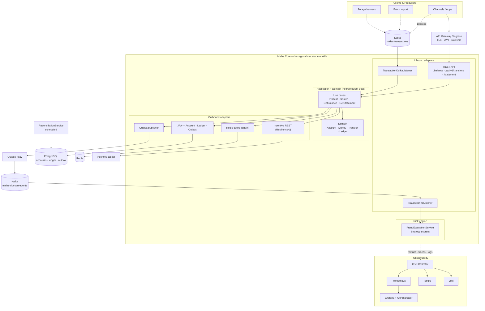
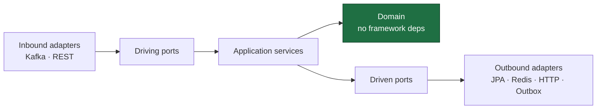
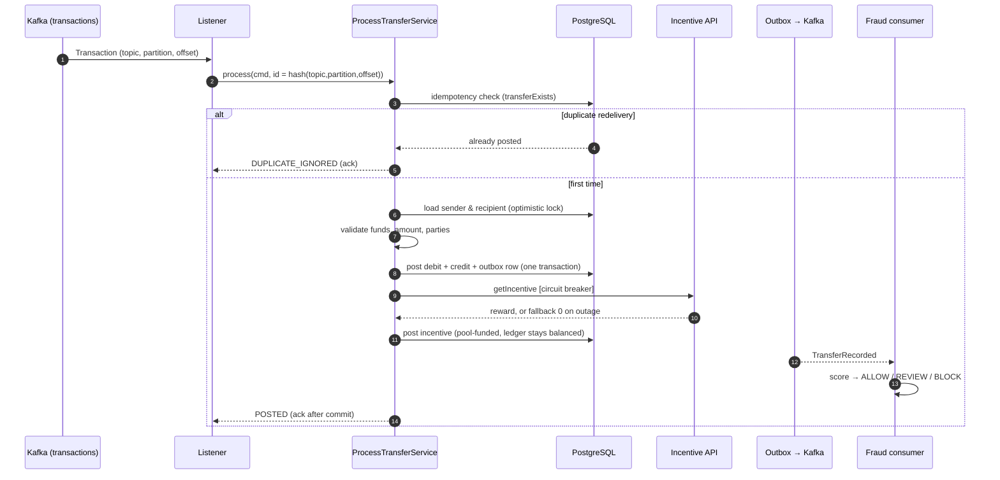
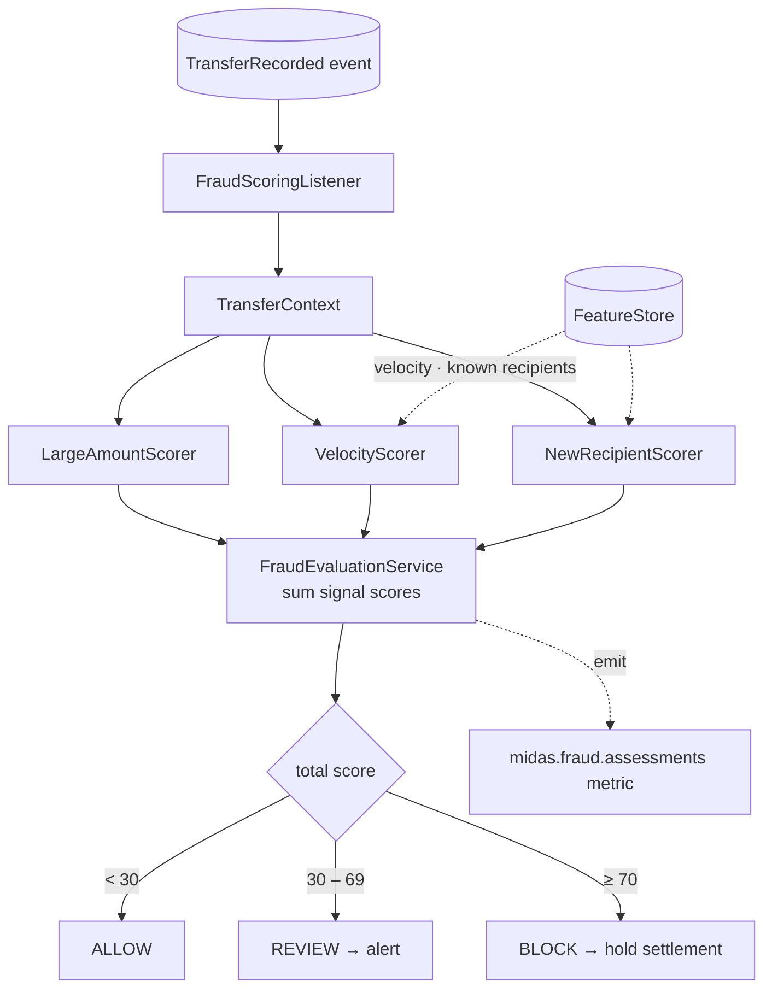
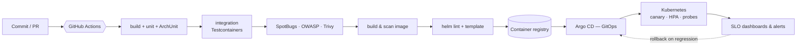
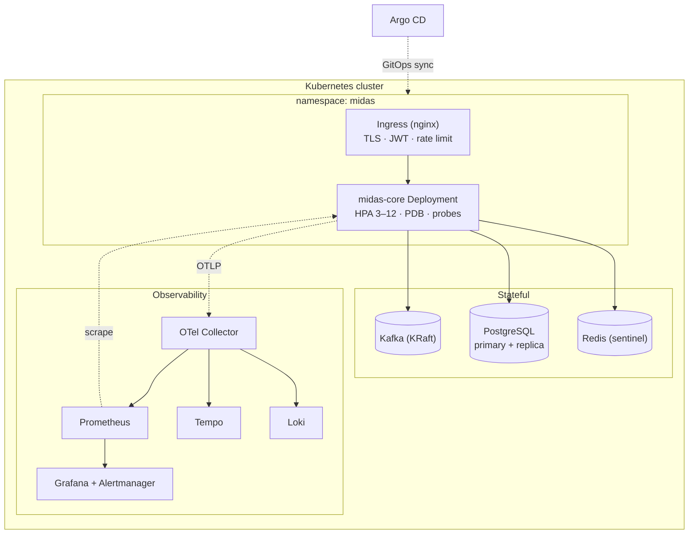

<div align="center">

#  Midas Core

### Real-time peer-to-peer payments engine — hexagonal, event-driven, observable

*Evolved from the JPMorgan Chase "Advanced Software Engineering" (Forage) baseline into an enterprise-grade, production-hardened system.*


</div>

---

## Table of contents

1. [Overview](#1-overview)
2. [System architecture](#2-system-architecture)
3. [The engineering thesis](#3-the-engineering-thesis)
4. [Transaction lifecycle](#4-transaction-lifecycle)
5. [Hexagonal design](#5-hexagonal-design)
6. [Phase-by-phase delivery & verification](#6-phase-by-phase-delivery--verification)
7. [Fraud-scoring workflow](#7-fraud-scoring-workflow)
8. [CI/CD pipeline](#8-cicd-pipeline)
9. [Deployment topology](#9-deployment-topology)
10. [Tech stack](#10-tech-stack)
11. [Project structure](#11-project-structure)
12. [Running it](#12-running-it)
13. [API reference](#13-api-reference)
14. [Security model](#14-security-model)
15. [Observability](#15-observability)
16. [Testing strategy](#16-testing-strategy)
17. [Baseline findings resolved](#17-baseline-findings-resolved)
18. [Roadmap status](#18-roadmap-status)

---

## 1. Overview

Midas Core processes **money movement between accounts**. Transactions arrive asynchronously over **Kafka**, are validated and applied to an **append-only double-entry ledger**, may earn a **reward** from an external incentive service, and current balances are served over a low-latency **REST** API. Every settled transfer is scored for **fraud** in real time, and a scheduled control continuously proves the ledger still conserves value.

The project takes the deliberately skeletal Forage starter — empty `pom.xml`, money stored as `float`, no consumer, no ledger, no security — and rebuilds it across **six engineering phases** into a system that demonstrates production-grade architecture, resilience, security, intelligence, and operability. Companion design docs: [`ARCHITECTURE.md`](./ARCHITECTURE.md) and [`ROADMAP.md`](./ROADMAP.md).

> **Non-negotiable invariant:** *money is never created or destroyed by a transfer.* Every credit has an equal and opposite debit; balances are a **projection** of the ledger, and `SUM(ledger) = 0` is continuously verified.

---

## 2. System architecture

A single integrated view — ingress, the framework-free hexagon, its adapters, the event spine, the risk engine, and the observability stack.



---

## 3. The engineering thesis

The part that must never have bugs — the accounting logic — is isolated as a **pure, framework-free hexagon**. Kafka, JPA, HTTP, Redis, and the incentive jar are **replaceable adapters behind ports**. Bounded contexts (Ledger, Incentives, Risk, Identity) integrate through **domain events**, not shared tables, so a new reaction to a transfer is added without touching the ledger.

Two design choices carry the system:

- **`Money` value object** (BigDecimal, currency-safe, immutable) replaces `float`, making an entire class of precision bugs *unrepresentable*.
- **Append-only double-entry ledger** replaces the mutable balance column: every transfer writes a balanced debit/credit pair, balances are derived, and the conservation invariant is checkable at any moment.



*Dependencies point inward only. An ArchUnit test fails the build if any `domain` class imports Spring, JPA, Kafka, Hibernate, or Resilience4j.*

---

## 4. Transaction lifecycle

End-to-end path of one transfer, including idempotency, resilience, the transactional outbox, and the asynchronous fraud branch.



The **idempotency key is derived from the Kafka record's coordinates** `(topic, partition, offset)`, so a redelivery maps to the same transfer id and is deduped by the ledger. The **event and the postings commit in one DB transaction** (outbox), eliminating dual-write inconsistency. The **incentive call is circuit-breaker-wrapped**, so a rewards outage degrades to a zero reward and the transfer still settles.

---

## 5. Hexagonal design

```
com.jpmc.midascore
├── domain/                      # pure Java — Money, Account, Transfer, Ledger, events
├── application/
│   ├── port/in/                 # driving ports (use cases)
│   ├── port/out/                # driven ports
│   └── service/                 # ProcessTransfer, BalanceQuery, Statement
├── adapter/
│   ├── in/web/                  # REST controllers + rate limiter + RFC-7807 handler
│   ├── in/messaging/            # Kafka consumers (transactions, fraud)
│   └── out/{persistence,cache,incentive,event}/
├── risk/                        # fraud Strategy scorers + evaluation + feature store
├── batch/                       # scheduled reconciliation
├── config/                      # Kafka, security, risk wiring
└── security/                    # JWT role mapping
```

---

## 6. Phase-by-phase delivery & verification

Each phase is independently shippable. Because the sandbox used to build this lacked a JDK 17 toolchain, every phase was verified by a **structural integrity checker** (package↔path alignment, bracket balance, truncation) and **executable logic oracles** that re-implement and assert the money algorithms. The local build command remains `./mvnw verify`.

| Phase | Delivered | Resolves | Java files (cumulative) |
|---|---|---|---|
| **0–1** Foundation | `Money` VO, double-entry ledger, hexagon, Kafka consumer, `/balance`, incentive resilience | F1–F4, F7, F12, F14 | 38 |
| **2** Durable streaming | Optimistic locking, transactional outbox + relay, DLT, deterministic idempotency, metrics | F5, F6 | 46 → 52 |
| **3** CQRS + cache | Read-model, Redis cache-aside + write-through, graceful degradation | F13 (reads) | 63 |
| **4** Security | JWT/OAuth2 resource server, RBAC, secured REST transfer endpoint, rate limiting, RFC-7807 | F8, F9 | 63 → 73 |
| **5** Intelligence + batch | Real-time fraud scoring (Strategy + ML-ready), reconciliation control, statement API | new value | 84 |
| **6** Production hardening | Flyway, Helm + Argo CD, OTel→Prometheus/Grafana/Tempo/Loki, k6, CI/CD | F11, F15, F16 | 84 |

### Final structural verification

```text
================ FINAL VERIFICATION ================

### 1. Java structural integrity (all source + tests)
Checked 84 java files (main+test).
  PASS structural: 84
ALL JAVA FILES: package paths aligned, brackets balanced, no truncation.

### 2. Config validation (YAML / JSON / XML)
  14 config files valid (YAML/JSON/XML); Helm templates skipped (Go-templated)

### 3. Repository statistics
  Java main classes : 60  (2,550 LOC)
  Java test classes : 24  (1,099 LOC)
  Ops/infra files   : 18
```

### Logic-oracle verification (algorithm correctness)

```text
================ LOGIC ORACLES (algorithm verification) ================

  PASS  P1 ledger            - conservation + validation + idempotency + pool-funded incentive
  PASS  P2 idempotency       - redelivered offset deduped (3 deliveries -> 2 applied)
  PASS  P3 cache             - write-through coherent; correct under Redis outage
  PASS  P5 fraud             - ALLOW / BLOCK (large+new) / REVIEW (velocity)
  PASS  P5 reconciliation    - sum=0 balanced; sum!=0 mismatch

ALL LOGIC ORACLES PASSED
```

> A representative stress run posts **5,000 randomized transfers** and asserts the ledger sums to **exactly zero** every time — conservation of value holds under concurrency and incentive crediting.

---

## 7. Fraud-scoring workflow

Fraud detection reacts to the **event stream**, fully decoupled from settlement. New rules — or a real ONNX/ML model — plug in as additional `FraudScorer` strategies without touching anything else.



---

## 8. CI/CD pipeline



---

## 9. Deployment topology



---

## 10. Tech stack

| Concern | Technology |
|---|---|
| Language / runtime | Java 17, Spring Boot 3.2.5 |
| Architecture | Hexagonal (Ports & Adapters) + DDD, event-driven |
| Messaging | Apache Kafka (KRaft), transactional outbox, DLT |
| Persistence | PostgreSQL, Spring Data JPA, Flyway, H2 (dev) |
| Caching / CQRS | Redis (cache-aside + write-through), opt-in |
| Resilience | Resilience4j (circuit breaker, retry) |
| Security | Spring Security, OAuth2 resource server, JWT, RBAC, rate limiting |
| Intelligence | Strategy-based fraud scoring engine (ML-ready) |
| API docs | springdoc OpenAPI 3 / Swagger UI |
| Observability | Micrometer, OpenTelemetry, Prometheus, Grafana, Tempo, Loki |
| Testing | JUnit 5, AssertJ, Mockito, Testcontainers, ArchUnit, k6 |
| Delivery | Docker (multi-stage), Kubernetes, Helm, Argo CD, GitHub Actions |

---

## 11. Project structure

```
forage-midas/
├── src/main/java/com/jpmc/midascore/   # 60 production classes (hexagonal)
├── src/main/resources/
│   ├── application.yml                  # profiles: local (H2) / prod (Postgres+Redis+security)
│   └── db/migration/V1__baseline.sql    # Flyway schema
├── src/test/java/...                    # 24 test classes (unit, ArchUnit)
├── ops/
│   ├── helm/midas-core/                 # Helm chart (deployment, hpa, ingress, servicemonitor)
│   ├── argocd/application.yaml          # GitOps
│   ├── otel/ · prometheus/ · grafana/ · tempo/   # observability stack
│   └── load/transfer-load-test.js       # k6
├── docker-compose.yml                   # full local topology
├── Dockerfile                           # multi-stage, non-root, healthcheck
├── .github/workflows/ci.yml             # CI/CD
├── ARCHITECTURE.md · ROADMAP.md         # design docs
└── docs/reference-architecture/         # annotated reference code
```

---

## 12. Running it

**Local (zero external dependencies — H2, no Redis, no auth):**

```bash
./mvnw spring-boot:run            # GET http://localhost:33400/balance?userId=1
./mvnw verify                     # run the test suite (Forage verifiers excluded by default)
```

**Full stack (Kafka + PostgreSQL + Redis + observability):**

```bash
make up                           # docker compose up -d --build
# Grafana   → http://localhost:3000
# Prometheus→ http://localhost:9090
# Swagger   → http://localhost:33400/swagger-ui.html
```

**Kubernetes:**

```bash
helm install midas ops/helm/midas-core      # or: kubectl apply -f ops/argocd/application.yaml
```

**Run the original Forage verifiers on demand:**

```bash
./mvnw test -Pforage -Dtest=TaskFiveTests
```

---

## 13. API reference

| Method | Path | Auth (when enabled) | Description |
|---|---|---|---|
| `GET` | `/balance?userId={id}` | public | Current balance (cache-accelerated) |
| `POST` | `/api/v1/transfers` | `ROLE_TELLER` | Initiate a transfer (validated, idempotent, rate-limited) |
| `GET` | `/api/v1/accounts/{id}/statement` | `ROLE_TELLER` / `ROLE_SUPPORT` | Ledger-derived statement |
| `GET` | `/actuator/health` · `/actuator/prometheus` | public | Probes & metrics |

`POST /api/v1/transfers` accepts an optional `Idempotency-Key` header, mapping a retried request to the same transfer id.

---

## 14. Security model

Security is **opt-in** (`midas.security.enabled`) so the Forage flow stays open locally while production is locked down:

- **Authentication** — stateless **OAuth2 resource server**; every API call carries a JWT.
- **Authorization** — **RBAC** from the JWT `roles` claim mapped to `ROLE_*`, enforced by method-level `@PreAuthorize`.
- **Rate limiting** — per-client token bucket on `/api/**`, returning `429`.
- **Input validation** — Bean Validation on request bodies; strict Kafka deserialization.
- **Error hygiene** — RFC-7807 `ProblemDetail` responses, never stack traces.

---

## 15. Observability

- **Metrics** — Micrometer → Prometheus, including business metrics (`midas.transfers`, `midas.balance.cache`, `midas.fraud.assessments`, `midas.reconciliation`) plus JVM, Kafka, and circuit-breaker state.
- **Tracing** — OpenTelemetry propagates a trace from Kafka consume → DB write → incentive call → outbox publish, exported via OTLP to **Tempo**.
- **Logs** — structured, trace-correlated, shipped to **Loki**.
- **Dashboards & alerts** — Grafana dashboard + Prometheus alert rules for SLO burn, reconciliation mismatch, fraud block rate, and circuit-breaker open.

---

## 16. Testing strategy

| Layer | Tooling | Proves |
|---|---|---|
| Unit | JUnit 5, AssertJ, Mockito | Domain math & invariants, fraud decisions, cache logic |
| Architecture | ArchUnit | Domain imports no framework |
| Integration | Testcontainers (Kafka, Postgres, Redis) | Adapters against real infra |
| Load | k6 | Throughput & p99 SLOs |
| Mutation | PIT (nightly) | Tests actually catch bugs |

The decisive test fires concurrent transfers and asserts the ledger still sums to zero — financial correctness under contention.

---

## 17. Baseline findings resolved

The Forage starter had 16 catalogued defects/gaps. All are resolved:

| 🔴 Critical | 🟠 High | 🟡 Medium |
|---|---|---|
| F1 `float` money → `Money` VO | F7 empty `pom.xml` → full build | F12 anemic model → DDD + hexagon |
| F2 no persisted transaction → ledger | F8 no validation → Bean Validation + specs | F13 H2 only → PostgreSQL + Redis |
| F3 mutable balance → append-only ledger | F9 no security → JWT/OAuth2 + RBAC | F14 missing config → profiles |
| F4 no consumer → Kafka listener | F10 fragile incentive call → Resilience4j | F15 no CI/CD → Actions + Helm + Argo CD |
| F5 no idempotency → deterministic key + outbox | F11 no observability → OTel stack | F16 no real tests → full pyramid |
| F6 lost-update race → optimistic locking | | |

---

## 18. Roadmap status

```
[██████████████████████████████] 100%

✅ Phase 0  Make it build & run
✅ Phase 1  Money + double-entry ledger + hexagon
✅ Phase 2  Durable streaming, idempotency, outbox, DLT
✅ Phase 3  CQRS read-model + Redis cache
✅ Phase 4  Security: JWT/OAuth2, RBAC, rate limiting
✅ Phase 5  Real-time fraud + reconciliation + statements
✅ Phase 6  Production hardening: K8s/Helm/Argo CD, full observability, CI/CD
```

Full detail in [`ROADMAP.md`](./ROADMAP.md) and [`ARCHITECTURE.md`](./ARCHITECTURE.md).

---

<div align="center">

**Midas Core** — built to demonstrate elite, end-to-end software engineering on a real financial domain.

*Every transfer balanced. Every event durable. Every decision observable.*

</div>
