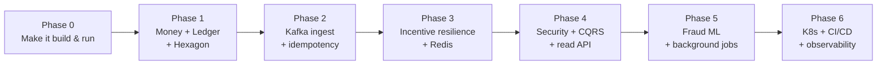

# Midas Core — Engineering Roadmap

> A step-by-step roadmap to evolve the JPMC *Midas Core* P2P payments engine from a skeletal Forage starter into an advanced, enterprise-grade, observable, and horizontally scalable system.
>
> Read this with its companion [`ARCHITECTURE.md`](./ARCHITECTURE.md) (target design + diagrams) and the runnable scaffolding in [`docs/reference-architecture/`](./docs/reference-architecture/), [`docker-compose.yml`](./docker-compose.yml), [`pom.xml`](./pom.xml), and [`.github/workflows/ci.yml`](./.github/workflows/ci.yml).

## How to read this document

The roadmap is organised in two passes. **Sections 1–5** are the *thematic* deep-dives mandated by the brief — Architecture, Features, Code Quality, Performance/Security, DevOps. **Section 6** re-cuts those themes into a *time-ordered* execution plan (Phase 0 → 6) so the work is actionable. Sections 7–8 cover risk and success metrics. Section 0 first establishes the baseline we are improving, because every recommendation traces back to a concrete defect or gap in the current code.

---

## 0. Current-State Findings — the baseline we are evolving

A precise audit of the repository as committed. Severity: 🔴 critical (correctness/safety) · 🟠 high · 🟡 medium.

| # | Finding | Evidence in repo | Sev | Remediation (section) |
|---|---|---|---|---|
| F1 | **Money stored as `float`** — cannot represent decimal cents; error compounds | `UserRecord.balance : float`, `Transaction.amount : float` | 🔴 | `Money` value object §1, §3 |
| F2 | **No transaction is ever persisted** — `Transaction` is not an entity; no audit trail | `foundation/Transaction.java` (POJO only) | 🔴 | Double-entry ledger §1, §2.1 |
| F3 | **Balance mutated in place** — destroys history, no reconciliation possible | `UserRecord.setBalance(...)` | 🔴 | Append-only ledger §2.1 |
| F4 | **No Kafka consumer in `src/main`** — the ingest path doesn't exist yet | consumer only implied by `KafkaProducer` test helper | 🔴 | Streaming ingest §2.1 |
| F5 | **No idempotency** — Kafka at-least-once ⇒ duplicate transfers double-post | no transfer id / dedupe anywhere | 🔴 | Idempotency §2.2, §4 |
| F6 | **No concurrency control** — read-modify-write of balance races; lost updates | no `@Version`, no locking | 🔴 | Optimistic locking §3, §4 |
| F7 | **Empty `pom.xml` `<dependencies>`** — project does not compile/run as committed | `pom.xml` | 🟠 | Refactored `pom.xml` §5 |
| F8 | **No validation** — overdraft, negative/zero amounts, self-transfer, unknown users | none present | 🟠 | Specification pattern §2, §3 |
| F9 | **No security** — `/balance` open, no auth/authz/rate-limit/sanitisation | none present | 🟠 | Security §4 |
| F10 | **No resilience on external incentive call** | `services/transaction-incentive-api.jar` not integrated | 🟠 | Resilience4j §2.3, §4 |
| F11 | **No observability** — no metrics, tracing, structured logs, health probes | no actuator/OTel | 🟠 | Observability §5 |
| F12 | **Anemic domain + leaky `DatabaseConduit`** — logic will leak into services | `DatabaseConduit` thin wrapper | 🟡 | Hexagonal + DDD §1, §3 |
| F13 | **H2 in-memory only** — no durability, no production parity | implied default | 🟡 | PostgreSQL §4, §5 |
| F14 | **Config missing/misplaced** — root `application.yml` empty; no `src/main/resources` | `application.yml` (root, empty) | 🟡 | Config + profiles §5 |
| F15 | **No CI/CD, containerisation, or IaC** | repo has none | 🟡 | CI/CD + Docker/K8s §5 |
| F16 | **Tests are Forage verifiers, not a suite** — no unit/integration/load tests | `Task*Tests.java` sleep-and-log | 🟡 | Test strategy §3 |

These sixteen items are the backlog. Everything below resolves them while adding enterprise-grade capability.

---

## 1. Architectural Evolution

### 1.1 The pattern: Hexagonal + DDD, event-driven core, modular monolith

The chosen architecture — **Ports & Adapters (Hexagonal)** for structure, **DDD** tactical patterns for the model, an **event-driven** spine for inter-context flow, packaged as a **modular monolith** with extraction seams — is justified in full in [`ARCHITECTURE.md` §3](./ARCHITECTURE.md#3-architectural-decision-hexagonal--ddd-event-driven-core). The one-paragraph rationale: the accounting logic is the part that must never have bugs, so we make it a *pure, framework-free hexagon* and push Kafka, JPA, HTTP, and the incentive jar out to *replaceable adapters behind ports*. Contexts integrate through **domain events**, not shared tables, so a new reaction to a transfer (fraud check, notification, analytics) is added without touching the ledger — Open/Closed at the architecture level.

### 1.2 Structural changes to decouple, modularise, and scale

**Decouple** by inverting dependencies. Today `DatabaseConduit` couples a "save" concept directly to Spring Data. In the target, the application depends on a domain-owned `AccountRepositoryPort` interface; the JPA implementation is an outbound adapter the domain never imports. The same inversion applies to messaging (`TransactionKafkaListener` is just a driving adapter that calls a use-case port) and to the incentive service (`IncentivePort`).

**Modularise** into the four bounded contexts — `ledger` (core), `incentives`, `risk`, `identity`, plus a `query` read-model module — each as a package with an enforced dependency direction. Use **ArchUnit** tests and **Spring Modulith** to fail the build if a module reaches across a boundary it shouldn't, or if an adapter is imported by the domain. This makes the modular boundaries *executable*, not aspirational.

**Scale** along three axes:

- *Stateless compute* — the runtime holds no session state, so it scales horizontally behind a Kubernetes HPA on CPU/lag.
- *Partitioned streaming* — key the Kafka topic by account so all transfers for an account land on one partition (ordering) while the topic as a whole scales out across consumers.
- *Read/write split (CQRS)* — the `query` module serves balances/statements from projections (Redis + read replicas), so read traffic never contends with the write path.

**Extraction path.** Start as one deployable. When a context needs independent scaling or release cadence, promote it to a service: the port/adapter seam becomes a network boundary, and the in-process domain event becomes a Kafka event — *no domain rewrite*. The first candidates are `identity` (clean, generic) and `query` (read-heavy).

---

## 2. Advanced Feature & Component Expansion

Five high-impact components. Each lists the rationale (the problem it solves) and the system design (how it's built).

### 2.1 Feature — Exactly-once double-entry ledger over a hardened Kafka stream

**Rationale.** Resolves F2–F5 at once: it makes transfers durable, auditable, ordered, and safe against redelivery. This is the heart of the system, so it is the first feature, not an afterthought.

**System design.** Inbound transactions arrive on a topic **partitioned by sender account** for per-account ordering. The `TransactionKafkaListener` deserialises into a `Transfer` command (schema enforced by **Avro + Schema Registry** so producers can't ship malformed money). `ProcessTransferService` runs the post inside a single DB transaction: load both accounts with optimistic locking, validate, write the **balanced debit/credit pair** to `LEDGER_ENTRY`, update the balance projection, and write a `TransferRecorded` row to the **transactional outbox** — all atomic. Manual offset acknowledgement commits *after* the DB commit. Poison messages route to a **dead-letter topic** with context. A polling relay (or Debezium CDC) publishes outbox rows to the `domain-events` topic. The exactly-once-*effect* machinery (Redis `SETNX` + `transfer.id` PK) is detailed in [`ARCHITECTURE.md` §8](./ARCHITECTURE.md#8-idempotency--exactly-once-effective-processing).

### 2.2 Feature — Redis caching, idempotency, and rate-limit tier

**Rationale.** Three jobs, one in-memory store: make `GET /balance` sub-millisecond (F13 read amplification), enforce idempotency cheaply on the hot path (F5), and back distributed rate limiting (F9).

**System design.** A **cache-aside** strategy for balances: read Redis first, fall back to the projection table on miss, and **invalidate on `TransferRecorded`** (event-driven cache coherence — no stale-TTL guessing). Idempotency uses `SETNX idemp:{transferId}` with a TTL window as the fast-path dedupe, backed by the durable PK constraint. Rate limiting uses a Redis token-bucket (e.g. Bucket4j) keyed by principal + route. Redis runs in Sentinel/cluster mode for HA; the cache is treated as *disposable* — a cold cache degrades latency, never correctness.

### 2.3 Feature — Resilient incentive settlement (external service integration)

**Rationale.** Resolves F10. The bundled `transaction-incentive-api.jar` is a third-party dependency on the settlement path; its latency or outage must never break money movement.

**System design.** An `IncentiveRestAdapter` implements `IncentivePort` behind a **Resilience4j** stack — `TimeLimiter → CircuitBreaker → Retry → Bulkhead` — over Spring's `RestClient`. On open circuit or timeout, the **fallback returns a zero reward** and enqueues the transfer for **deferred settlement** (a background job retries when the circuit closes), so the user's transfer always completes. Calls are made **asynchronously on a virtual-thread executor** so incentive latency doesn't serialise transfer throughput. Diagram in [`ARCHITECTURE.md` §10](./ARCHITECTURE.md#10-resilience--the-external-incentive-call); reference code in [`IncentiveRestAdapter.java`](./docs/reference-architecture/adapter/out/incentive/IncentiveRestAdapter.java).

### 2.4 Feature — Real-time fraud / anomaly detection (AI/ML on the stream)

**Rationale.** A payments engine without fraud controls is incomplete. This adds tangible enterprise value and exercises a genuinely complex subsystem.

**System design.** The `risk` context consumes `TransferRecorded` and scores each transfer in real time. Start with **explainable rules + statistical features** computed over a sliding window with **Kafka Streams** (velocity: count/sum per account per minute; deviation from rolling mean; new-recipient flag; structuring patterns). Graduate to an ML model: features are engineered in the stream and served from a lightweight model — **ONNX Runtime** in-process for low latency, or a sidecar inference service for heavier models, with the boundary hidden behind a `FraudScorerPort`. A score over threshold emits `TransferFlagged` → holds settlement / alerts. The **Strategy pattern** lets rule-based and model-based scorers coexist and be A/B compared. Models are versioned; scoring decisions are logged for audit and for training-data feedback.

### 2.5 Feature — CQRS read models, statements, and real-time balance push

**Rationale.** Resolves F13 read amplification and adds product surface (history, statements, live updates) that the single `float balance` column can't support.

**System design.** Project `TransferRecorded` into read-optimised models: a **hot-balance** projection in Redis, a **transaction-history** view in Postgres (indexed for pagination), and **PDF/CSV statements** generated by a background job. A **Server-Sent Events / WebSocket** endpoint pushes balance changes to subscribed clients the moment a transfer settles (driven by the same event), turning a poll-the-balance UX into a live one. Because reads are a separate model, the query side scales and caches independently of writes.

> **Background processing** underpins 2.3–2.5 (deferred incentive settlement, statement generation, projection rebuilds, **nightly reconciliation** of `balance_minor` vs `SUM(ledger)`). On the JVM this is **Spring `@Async` + `@Scheduled`** for light work and **Quartz** (or a Kafka-driven worker) for durable, clustered jobs — the architectural equivalent of Celery/Sidekiq.

---

## 3. Code Quality, Patterns & Refactoring

### 3.1 SOLID — where each principle bites

- **S (Single Responsibility).** Split the would-be "TransactionService" god-class into a thin `ProcessTransferService` (orchestration) and pure domain objects that own their rules (`Account.canDebit`, `Money` arithmetic). The Kafka listener only adapts transport; it holds no business logic.
- **O (Open/Closed).** New incentive schemes, fraud rules, or notification channels are added as new `Strategy`/event-subscriber implementations — no edits to settled code.
- **L (Liskov).** Every `…Port` implementation is substitutable; tests swap the JPA adapter for an in-memory fake with identical behaviour and no special-casing.
- **I (Interface Segregation).** Narrow ports (`LoadAccountPort`, `AppendLedgerPort`, `IncentivePort`) instead of one fat repository, so a consumer depends only on what it uses.
- **D (Dependency Inversion).** The whole hexagon: application/domain depend on interfaces they own; infrastructure depends inward. This is the structural fix for F12.

### 3.2 GoF design patterns — applied, not decorative

| Pattern | Applied to | Why |
|---|---|---|
| **Value Object** | `Money` | Make `float` bugs (F1) unrepresentable; immutable, currency-safe |
| **Strategy** | Incentive calculation, fraud scoring | Swap/compose algorithms (rules vs ML) without branching (O in SOLID) |
| **Factory** | Adapter & deserializer creation, `Money.of(...)` | Centralise valid construction; reject bad state early |
| **Observer / Domain Events** | `TransferRecorded` → incentives, risk, notifications | Decouple reactions from the core write |
| **Decorator** | Resilience4j wrappers around `IncentivePort` | Add timeout/retry/circuit-breaker without touching call sites |
| **Specification** | Transfer validation (funds, amount>0, not self, known users) | Compose validation rules; resolves F8 |
| **Adapter / Ports** | Kafka, JPA, REST, Redis | The architecture itself; replaceable infrastructure |
| **Outbox / Transactional Messaging** | Event publication | Atomic DB+event; eliminates dual-write (F2/F5 adjacent) |

### 3.3 Concurrency & asynchronous processing

- **Optimistic locking** (`@Version` on `Account`) resolves the lost-update race (F6); conflicting concurrent transfers retry rather than silently overwrite. Escalate to **pessimistic `SELECT … FOR UPDATE`** only for the rare hot-account contention case.
- **Java 21 virtual threads** for the Kafka consumer pool and the incentive HTTP calls — high I/O concurrency without thread-pool tuning gymnastics.
- **Asynchronous, non-blocking external calls** (`@Async` + `CompletableFuture`) so incentive latency overlaps rather than serialises throughput.
- **Per-account partition ordering** in Kafka gives single-writer-per-account semantics, removing most cross-account contention by design.
- **Idempotent consumers** so retries are safe (ties to §2.2).

### 3.4 Testing strategy — the pyramid, made rigorous (resolves F16)

| Layer | Tooling | What it proves |
|---|---|---|
| **Unit** | JUnit 5, AssertJ, Mockito | Domain math & invariants: `Money`, `Account.debit`, Specifications — pure, millisecond-fast, the bulk of tests |
| **Architecture** | ArchUnit, Spring Modulith | Dependency rules hold: domain imports no framework; modules respect boundaries |
| **Integration** | **Testcontainers** (real Kafka, PostgreSQL, Redis) | Adapters work against real infra, not mocks; idempotency & outbox actually behave |
| **Contract** | Pact / Spring Cloud Contract | The incentive API and event schemas don't break consumers |
| **E2E** | Testcontainers compose / k8s ephemeral | Full path: produce transaction → settle → `GET /balance` reflects it |
| **Load / soak** | **k6** or **Gatling** | Throughput & p99 under sustained TPS; no balance drift under concurrency |
| **Mutation** | **PIT** | The tests actually catch bugs, not just cover lines |
| **Static/SAST** | SpotBugs, Error Prone, OWASP Dependency-Check | Defects and vulnerable deps caught pre-merge |

Target: ~85% line coverage as a floor with **mutation score** as the real quality gate, plus a concurrency test that fires N parallel transfers at one account and asserts the ledger still sums correctly.

---

## 4. Performance, Security & Optimization

### 4.1 High concurrency

Single-writer-per-account via partition keying, optimistic locking with bounded retry, virtual-threaded I/O, and a stateless runtime behind an HPA. Backpressure is natural: consumer lag is the scaling signal; Kafka buffers spikes so the database is never stampeded. The incentive **bulkhead** caps concurrent external calls so one slow dependency can't exhaust the thread budget.

### 4.2 Database query optimization, indexing, state management

- **PostgreSQL** replaces H2 (F13) for ACID-at-scale, partial indexes, and `jsonb`.
- **Indexes:** PK on `transfer.id` (also the idempotency guard); composite `(account_id, created_at desc)` on `ledger_entry` for fast history/statement pagination; partial index `WHERE published = false` on `outbox` so the relay scans only unpublished rows; FK indexes on `sender_id`/`recipient_id`.
- **Query hygiene:** kill N+1 with explicit fetch joins / `@EntityGraph`; **keyset (seek) pagination** instead of `OFFSET` for history; `HikariCP` pool sized to DB cores; read replicas for the query side.
- **State management:** source of truth in Postgres; hot derived state in Redis (cache-aside, event-invalidated); no state in app memory beyond request scope, so any replica can serve any request.

### 4.3 Enterprise-grade security (resolves F9)

- **AuthN:** **OAuth2 / OIDC** with short-lived **JWT** access tokens validated at the gateway and the resource server; refresh-token rotation; service-to-service auth via client-credentials or **mTLS**.
- **AuthZ:** **RBAC** (`ROLE_USER`, `ROLE_SUPPORT`, `ROLE_ADMIN`) with **method-level** `@PreAuthorize`, plus ownership checks so a user can only read *their* balance — the open `/balance?userId=` becomes principal-scoped.
- **Input sanitisation & validation:** Bean Validation (`@Valid`) on all inbound DTOs, strict Avro schemas on Kafka, parameterised queries only (JPA/criteria), output encoding. Money inputs validated as positive, in-range, single-currency.
- **Rate limiting & abuse control:** Redis token-bucket per principal/IP/route (§2.2); global gateway limits; sensible quotas on the balance and transfer endpoints.
- **Secrets & data protection:** no secrets in the image or `application.yml` — **Vault / sealed secrets**; TLS in transit; encryption at rest; **PII minimisation** and field-level encryption where needed.
- **Audit & compliance:** the append-only ledger *is* the financial audit trail; add a security audit log for auth events; **OWASP Dependency-Check** + container scanning in CI.

### 4.4 Optimization targets (SLOs)

Transfer settlement **p99 < 150 ms** (excluding async incentive), `GET /balance` **p99 < 20 ms** (cache hit), sustained **≥ 2,000 TPS** per node before horizontal scale, consumer lag **→ 0** within seconds of a spike. These become Grafana SLO dashboards and alert thresholds (§5).

---

## 5. DevOps & Infrastructure

### 5.1 Containerisation & CI/CD

- **Multi-stage `Dockerfile`** ([provided](./Dockerfile)) → small, non-root, distroless-style JRE image; reproducible builds.
- **`docker-compose.yml`** ([provided](./docker-compose.yml)) reproduces the full topology locally — Kafka, PostgreSQL, Redis, Prometheus, Grafana — so local and prod parity is real.
- **CI** (GitHub Actions, [provided](./.github/workflows/ci.yml)): build → unit + ArchUnit → Testcontainers integration → SAST (SpotBugs/Error Prone) → OWASP Dependency-Check → mutation (PIT, nightly) → build & scan image → publish. Branch protection requires green + review.
- **CD:** GitOps with **Argo CD** / Helm to Kubernetes; **progressive delivery** (canary or blue-green) with automated rollback on SLO regression; database changes via **Flyway/Liquibase** migrations gated in the pipeline.
- **Kubernetes:** Deployment + HPA (CPU + Kafka-lag custom metric), liveness/readiness/startup probes wired to **Spring Boot Actuator**, `PodDisruptionBudget`, resource requests/limits, and the topology in [`ARCHITECTURE.md` §12](./ARCHITECTURE.md#12-deployment-topology-target).

### 5.2 Observability stack (resolves F11)

- **Metrics:** **Micrometer → Prometheus** ([scrape config provided](./ops/prometheus/prometheus.yml)); RED metrics per endpoint/consumer, JVM/GC, Hikari pool, Kafka lag, circuit-breaker state, plus **business metrics** (transfers/sec, rejected, reward settled, fraud flags). Visualised in **Grafana** with SLO panels.
- **Tracing:** **OpenTelemetry** auto-instrumentation propagates a trace from the Kafka consume through the DB write, the incentive HTTP call, and the outbox publish, exported to **Tempo/Jaeger** — so a slow transfer is debuggable end-to-end across the async boundary.
- **Logging:** **structured JSON** logs with the **trace_id** injected, shipped to **Loki**; correlate a log line to its trace and metric spike in one click.
- **Alerting:** Prometheus Alertmanager on SLO burn-rate (latency, error rate, consumer lag, circuit-breaker open, reconciliation mismatch) → on-call. Dashboards-as-code and alerts-as-code live in the repo.

---

## 6. Phased execution plan

Each phase is independently shippable and leaves the system better than it found it. "Exit criteria" are the gates.

| Phase | Goal | Key work | Resolves | Exit criteria |
|---|---|---|---|---|
| **0** | Build green | Fill `pom.xml`, add `src/main/resources/application.yml`, Postgres profile, Flyway baseline, CI skeleton | F7, F14 | `mvn verify` passes; app boots; CI runs |
| **1** | Correct money model | `Money` VO, `Account` aggregate, double-entry `ledger`, hexagonal packages, ArchUnit rules | F1–F3, F12 | Unit-tested invariants; balances derive from ledger |
| **2** | Durable streaming ingest | Kafka consumer, Avro+Schema Registry, idempotency (Redis+PK), outbox + relay, DLQ, optimistic locking | F4–F6 | Replays don't double-post; concurrency test green |
| **3** | Resilient incentives + cache | `IncentivePort` + Resilience4j, deferred settlement job, Redis cache-aside + invalidation | F10, F13(read) | Incentive outage ⇒ transfers still settle |
| **4** | Security + read side | OAuth2/JWT, RBAC, rate limiting, validation; CQRS projections, `GET /balance` (scoped), statements, SSE push | F8, F9, F13 | Pen-test basics pass; balance API authn/authz'd |
| **5** | Intelligence + batch | Kafka Streams features, fraud scorer (Strategy: rules→ONNX), reconciliation + statement jobs (Quartz) | new value | Fraud flags emit; nightly reconciliation = 0 drift |
| **6** | Production hardening | Dockerfile, Helm/Argo CD, K8s HPA+probes, full OTel/Prometheus/Grafana/Tempo/Loki, load tests, alerts | F11, F15, F16 | SLO dashboards live; k6 hits TPS target; canary+rollback proven |

---

## 7. Risk register

| Risk | Likelihood | Impact | Mitigation |
|---|---|---|---|
| Balance drift under concurrency | Med | 🔴 | Double-entry ledger + optimistic locking + nightly reconciliation + concurrency tests |
| Duplicate processing on Kafka redelivery | High | 🔴 | Idempotency key (Redis + PK) + transactional outbox |
| Incentive API outage stalls settlement | Med | 🟠 | Circuit breaker + zero-reward fallback + deferred settlement |
| Schema drift from upstream producers | Med | 🟠 | Avro + Schema Registry compatibility checks in CI |
| Big-bang migration breaks the Forage tests | Med | 🟡 | Phased plan; keep adapters compatible; reference code stays out of build path until promoted |
| Over-distribution (premature microservices) | Med | 🟡 | Modular monolith first; extract only on proven need |
| Secret leakage | Low | 🔴 | Vault/sealed-secrets; no secrets in image/yaml; CI secret scanning |

---

## 8. Success metrics

**Engineering health:** mutation score (quality gate), ArchUnit boundary violations = 0, CI < 10 min, change-failure rate and MTTR (DORA).
**Runtime SLOs:** settlement p99 < 150 ms, balance p99 < 20 ms, ≥ 2,000 TPS/node, consumer lag → 0 on spike, **financial correctness: `SUM(ledger) == 0` and projection drift = 0** (the metric that matters most for a payments system).
**Resilience:** transfers settle at 100% during a simulated incentive-API outage; zero double-posts in a redelivery chaos test.

---

## Appendix — target technology stack

| Concern | Choice |
|---|---|
| Language / runtime | Java 21 (virtual threads), Spring Boot 3.x |
| Architecture | Hexagonal + DDD, Spring Modulith, event-driven |
| Messaging | Apache Kafka + Schema Registry (Avro), Kafka Streams |
| Persistence | PostgreSQL, Spring Data JPA, Flyway, HikariCP |
| Cache / idempotency / rate-limit | Redis (Sentinel/cluster), Bucket4j |
| Resilience | Resilience4j |
| Security | Spring Security, OAuth2/OIDC, JWT, RBAC |
| ML / fraud | Kafka Streams features, ONNX Runtime |
| Testing | JUnit 5, AssertJ, Mockito, Testcontainers, Pact, k6/Gatling, PIT, ArchUnit |
| Observability | Micrometer, Prometheus, Grafana, OpenTelemetry, Tempo, Loki |
| Containers / orchestration | Docker (multi-stage), Kubernetes, Helm, Argo CD |
| CI/CD | GitHub Actions, SpotBugs/Error Prone, OWASP Dependency-Check |

*See [`ARCHITECTURE.md`](./ARCHITECTURE.md) for diagrams and design detail, and [`docs/reference-architecture/`](./docs/reference-architecture/) for runnable reference code mapped to Phases 1–3.*
